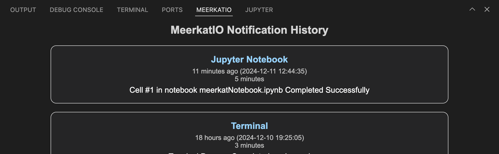

    

## Features Overview

### 1. Identify and Monitor Productivity Bottlenecks
Gain insights into your workflow by tracking and analyzing where your time is spent. Use MeerkatIO to pinpoint bottlenecks and optimize your productivity.

### 2. Keep Track of Your Longest Running Executions
Easily monitor tasks that take the longest time, enabling you to identify opportunities for efficiency improvements.

### 3. Copy and Paste Terminal Commands with Ease
Simplify your workflow by copying and reusing terminal commands directly from MeerkatIO, saving you valuable time and effort.
